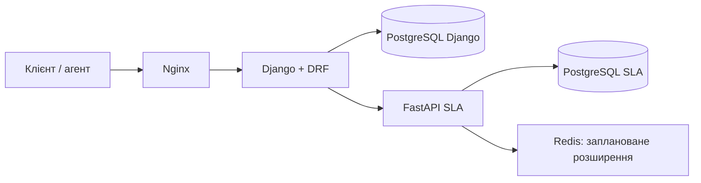

```mermaid
flowchart LR
 U[Клієнт / агент] --> N[Nginx]
 N --> D[Django + DRF]
 D --> P[(PostgreSQL Django)]
 D --> F[FastAPI SLA]
 F --> S[(PostgreSQL SLA)]
 F --> R[Redis: заплановане розширення]
```
